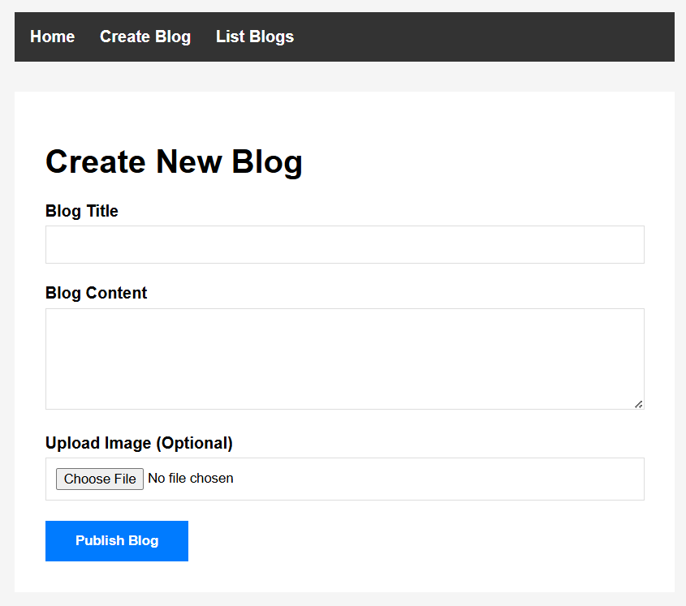

# 📝 Flask Blog Application

<p align="center">
  
  
  
</p>

---

## 🚀 Overview

Welcome to the **Flask Blog Application**! This is a simple, clean, and functional blog web app built with **Flask**, **SQLite**, and **SQLAlchemy**. Easily create, edit, and delete blog posts, with optional image uploads and a beautiful, responsive interface.

---

## ✨ Features

- 🖋️ **Create, Edit, and Delete Blog Posts**
- 🖼️ **Upload and Display Images** (JPG, PNG, GIF, etc.)
- 🕒 **Auto-generated Timestamps** (Created & Updated)
- 💾 **SQLite Database** with SQLAlchemy ORM
- ⚡ **Flash Messages** for User Feedback
- 📄 **Blog Listing, Detail, and Success Pages**
- 🎨 **Modern, Responsive UI** (HTML, CSS, Jinja2)

---

## 🛠️ Tech Stack

- **Backend:** Python, Flask
- **Database:** SQLite, SQLAlchemy
- **Frontend:** HTML, CSS (Jinja2 Templates)
- **Others:** Werkzeug, Jinja2

---

## 📂 Project Structure

```
Flask_Blog/
│
├── static/
│   └── uploads/         # Uploaded images
│
├── templates/
│   ├── base.html        # Base template
│   ├── home.html        # Homepage (blog list)
│   ├── createblog.html  # Create blog form
│   ├── edit.html        # Edit blog form
│   ├── detail.html      # Blog detail page
│   ├── listblogs.html   # List all blogs
│   └── success.html     # Confirmation page
│
├── BlogPost.db          # SQLite database
├── app.py               # Main Flask app
└── README.md            # Project documentation
```

---

## ▶️ Getting Started

### 1. Clone the Repository

```bash
git clone https://github.com/your-username/flask-blog-app.git
cd flask-blog-app
```

### 2. Set Up a Virtual Environment

```bash
python -m venv venv
# On Windows:
venv\Scripts\activate
# On macOS/Linux:
source venv/bin/activate
```

### 3. Install Dependencies

```bash
pip install flask flask_sqlalchemy pytz
```

### 4. Run the Application

```bash
python app.py
```

Visit [http://127.0.0.1:5000/](http://127.0.0.1:5000/) in your browser.

---

## 📸 Screenshot



---

## 📜 License

This project is licensed under the MIT License.

---

## 🙌 Acknowledgements

- [Flask Documentation](https://flask.palletsprojects.com/)
- [SQLAlchemy ORM](https://www.sqlalchemy.org/)
- [Jinja2 Template Engine](https://jinja.palletsprojects.com/)

---

## 💡 Author

**Rishabh Dhawad**  
[GitHub Profile](https://github.com/rishabhdhawad)

---

> _Crafted with passion for learning and sharing!_
> 
> If you like this project, feel free to ⭐️ the repo and connect with me on GitHub!

<p align="center">
  <b>Happy Blogging! 🚀</b>
</p>

